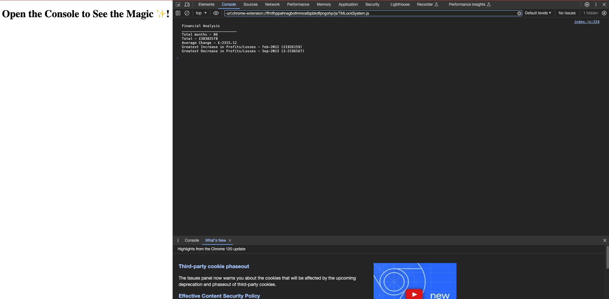

# Week 4 Challenge: Work out the Finances Algorithim

## Project status
Finished acceptance criteria for Module 4

## Name
Lisa Spencer: Console Finances

## Description
This page is the challenge/homework for Week 4 of my Bootcamp course. The aim is to create an algorithim using Javascript with a set of financial data (dates and profit/loss) to view the total number of months, the total profit over all months, the average change between each month after month and the greatest increase and decrease in profits/losses overall. 

## Link to deployed application
https://lisaspencer1997.github.io/Console-Finances/

## Screenshot

## Support
Contact me on lisa-spencer@outlook.com if something is not working as intended.

## Authors and acknowledgment
* https://www.freecodecamp.org/news/var-let-and-const-whats-the-difference/
* https://stackoverflow.com/questions/60203646/how-can-i-store-the-previous-value-of-a-variable-in-javascript
* https://www.w3schools.com/jsref/jsref_tofixed.asp
* https://www.codecademy.com/forum_questions/54cd35d8d3292fbb19001e02

## License
This is licenced through MIT. 
